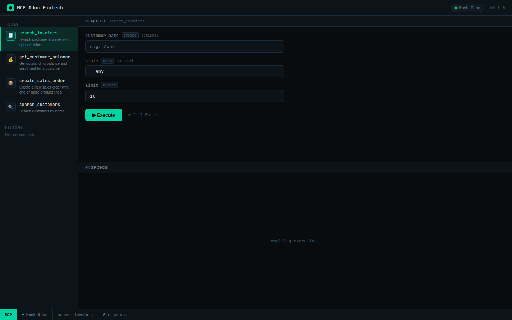
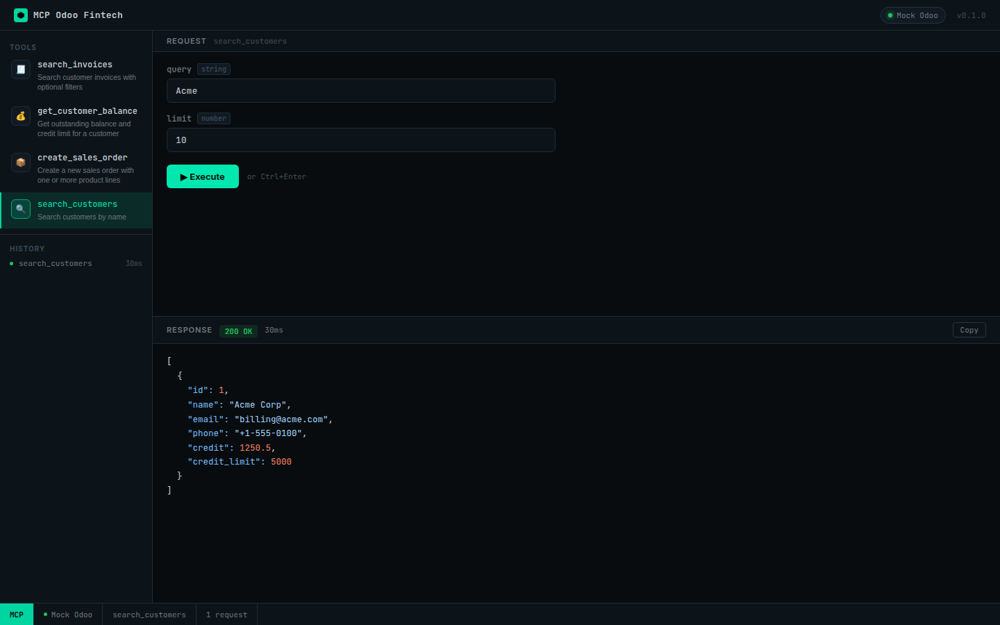
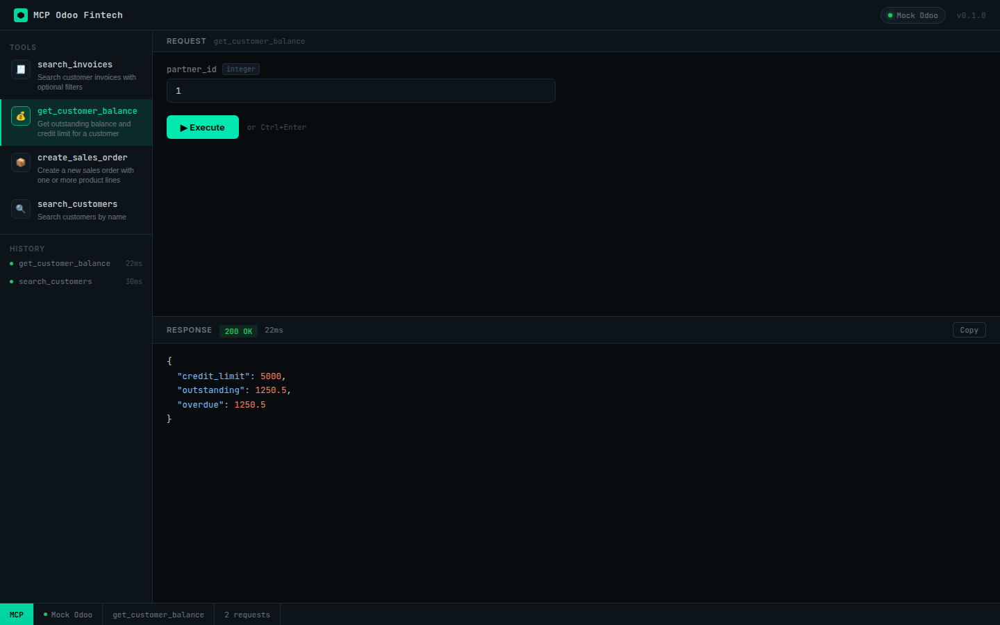
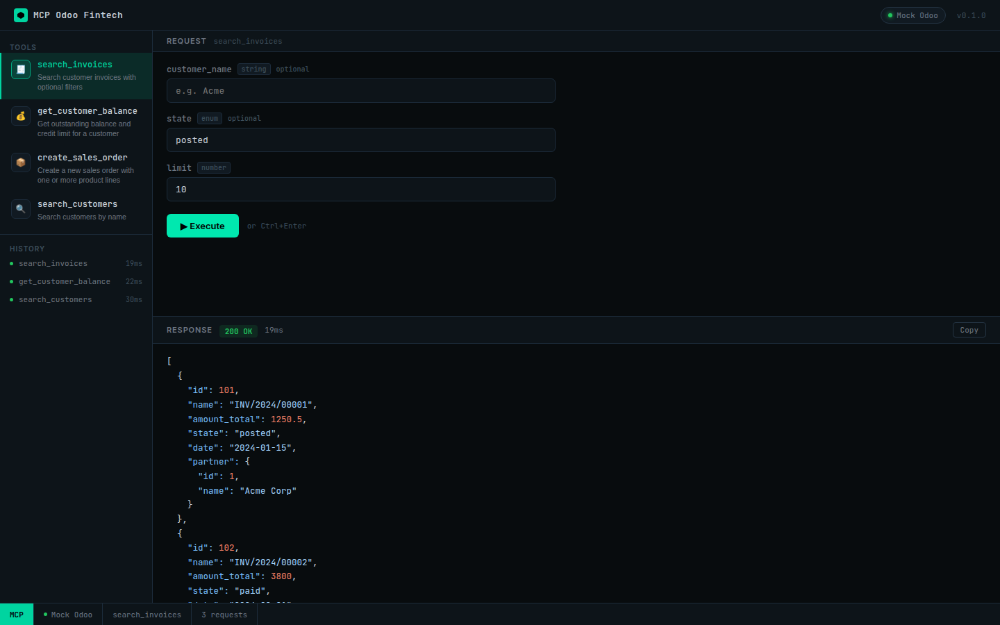
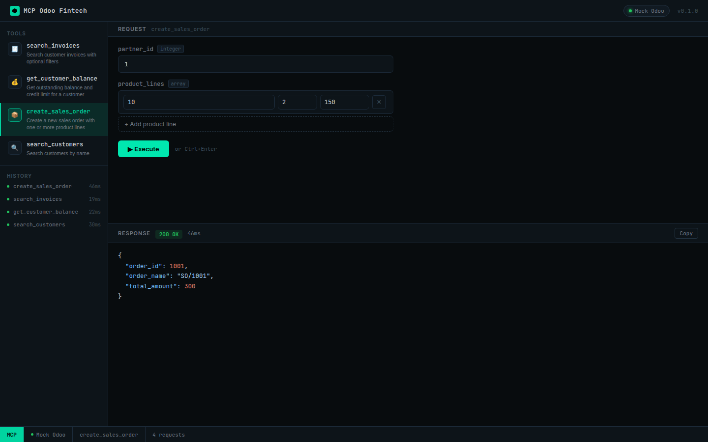

# mcp-odoo-fintech

> TypeScript MCP server that connects Claude Desktop to Odoo ERP via the modern **JSON-RPC 2.0 API** (the XML-RPC era is over).
> Ships with a dark **Web Inspector UI** so you can test every tool interactively — no Claude Desktop required.

[](https://github.com/IsliBasha/mcp-odoo-fintech/actions)
[](#testing)
[](https://www.typescriptlang.org/)
[](LICENSE)

---

## Web Inspector UI

The server includes an interactive browser-based inspector at `http://localhost:3001`.
Execute any MCP tool with real (or mock) Odoo data, inspect JSON responses with syntax highlighting, and track request history — all without leaving the browser.











---

## Architecture

```
Claude Desktop ──stdio──► MCP Server ──JSON-RPC 2.0──► Odoo 17+
                               │
                               ├─ Redis Cache (optional)
                               ├─ Express :3001
                               │    ├─ /            Web Inspector UI
                               │    └─ /webhook     HMAC-verified events
                               └─ Mock Odoo (auto-enabled when MOCK_ODOO=true)
```

## MCP Tools

| Tool | Odoo model | Description |
|------|-----------|-------------|
| `search_invoices` | `account.move` | Filter by customer, state, date range |
| `create_sales_order` | `sale.order` | Create order with multiple product lines |
| `get_customer_balance` | `res.partner` | Credit limit, outstanding balance, overdue total |
| `search_customers` | `res.partner` | Find customers by partial name |

---

## Quick Start

### Zero-config demo (mock Odoo, no real ERP needed)

```bash
npm install
npm run dev          # starts mock Odoo on :8069 + inspector on :3001
```

Open **http://localhost:3001** and start executing tools.

### Real Odoo instance

```bash
cp .env.example .env
# Fill in ODOO_URL, ODOO_DB, ODOO_API_KEY
npm run dev
```

### Claude Desktop integration

Add to `claude_desktop_config.json`:

```json
{
  "mcpServers": {
    "odoo-fintech": {
      "command": "node",
      "args": ["/path/to/mcp-odoo-fintech/dist/index.js"],
      "env": {
        "ODOO_URL": "https://your-odoo.example.com",
        "ODOO_DB": "prod",
        "ODOO_API_KEY": "your-api-key"
      }
    }
  }
}
```

---

## Security

- **HMAC-SHA256 webhook verification** with timing-safe comparison (`timingSafeEqual` + length guard)
- **Bearer token auth** — API keys via `.env` only, never committed
- **Redis sliding-window rate limiting** per tool (optional, skipped gracefully when `REDIS_URL` is absent)
- **Zod input validation** on every tool call before Odoo is touched

---

## Testing

```bash
npm test                 # run 33 tests
npm run test:coverage    # 93% coverage report
```

Test suite covers: Odoo client (JSON-RPC 2.0 envelope, error types), HMAC verification (valid/tampered/empty), all 4 tools against a mock Odoo server.

---

## Project Structure

```
src/
├── client/       # Odoo JSON-RPC 2.0 HTTP client
├── tools/        # MCP tool implementations (customers, invoices, sales)
├── mock/         # Mock Odoo JSON-RPC 2.0 server for offline testing
├── security/     # HMAC-SHA256 webhook verification
├── webhook/      # Express webhook receiver
├── inspector/    # Web Inspector UI (server + static HTML/CSS/JS)
└── index.ts      # MCP stdio entry point + HTTP server bootstrap
tests/            # Vitest integration tests
```

---

## Environment Variables

| Variable | Default | Description |
|----------|---------|-------------|
| `ODOO_URL` | `http://localhost:8069` | Odoo base URL |
| `ODOO_DB` | `odoo` | Odoo database name |
| `ODOO_API_KEY` | — | Odoo API key (required for production) |
| `WEBHOOK_SECRET` | — | HMAC secret for incoming Odoo webhooks |
| `REDIS_URL` | — | Redis connection URL (rate-limiting, optional) |
| `PORT` | `3001` | HTTP server port (inspector + webhook) |
| `MOCK_ODOO` | `false` | Start built-in mock Odoo server |

---

## License

MIT © [Isli Basha](https://github.com/IsliBasha)
